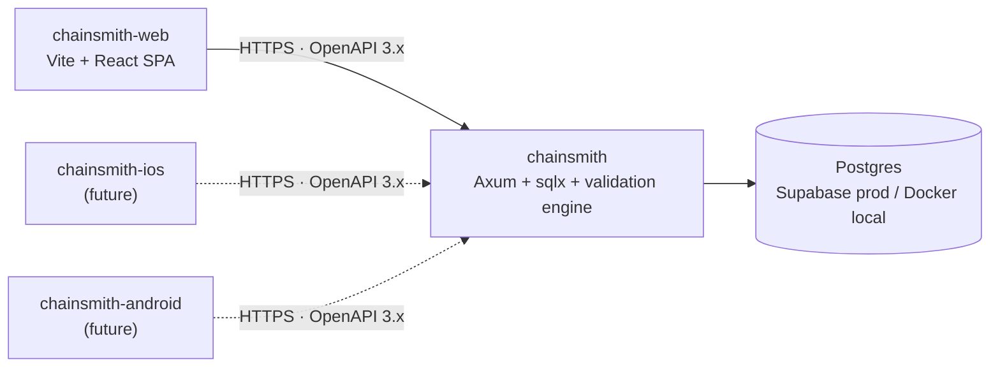

Headless Rust backend and validation engine for **Chainsmith**, a design-first deck builder and collection manager for [Flesh and Blood TCG](https://fabtcg.com/).

This repo is the API service. The web client and any future native clients live in their own repos and talk to this service over HTTP.

## Status

Pre-1.0 and under active development. APIs, schemas, and migrations are subject to change without notice until the project moves to its production phase. See [`CLAUDE.md`](CLAUDE.md) for the phase model that governs when stability guarantees kick in.

## Architecture



The repos under [`chainsmith-deck-builder`](https://github.com/chainsmith-deck-builder):

| Repo | Purpose |
|---|---|
| **`chainsmith`** | This repo. Headless Rust API, validation engine, DB layer, card data sync. |
| `chainsmith-web` | Vite + React + TypeScript web client. |
| `chainsmith-ios`, `chainsmith-android` | Reserved for future native clients. Not in active scope. |
| `tracker` | Cross-repo issue tracker for things that span multiple repos. |

## Tech stack

- **HTTP**: [Axum](https://github.com/tokio-rs/axum) on [Tokio](https://tokio.rs/), with [utoipa-axum](https://github.com/juhaku/utoipa) auto-generating an OpenAPI 3.x spec
- **Database**: Postgres via [sqlx](https://github.com/launchbadge/sqlx) with compile-time-checked queries
- **Auth**: Supabase-issued JWTs verified server-side via JWKS
- **Card data**: synced nightly from [the-fab-cube/flesh-and-blood-cards](https://github.com/the-fab-cube/flesh-and-blood-cards)
- **Build / deploy**: Dockerfile, target [Fly.io](https://fly.io) (provisional)

## Getting started

### Prerequisites

| Tool | Version | Install |
|---|---|---|
| Rust | stable 1.95+ | [rustup.rs](https://rustup.rs/) |
| Docker | any recent | [Docker Desktop](https://www.docker.com/products/docker-desktop/) |
| gitleaks | 8.18+ | `winget install Gitleaks.Gitleaks` (Windows) · `brew install gitleaks` (macOS) · [release binaries](https://github.com/gitleaks/gitleaks/releases) (other) |

### One-time setup

```bash
# 1. Fork the repo on GitHub, then clone your fork
git clone git@github.com:<your-username>/chainsmith.git
cd chainsmith

# 2. Add the upstream remote so you can keep your fork in sync
git remote add upstream https://github.com/chainsmith-deck-builder/chainsmith.git

# 3. Wire up the pre-commit hook (gitleaks + fmt + clippy + tests)
git config core.hooksPath .githooks

# 4. Provision env vars
cp .env.example .env
```

### Run locally

```bash
docker compose up -d        # start Postgres
cargo run                   # build and serve on :8080 (runs migrations on start)
```

Verify it's up:

```bash
curl http://localhost:8080/health
# {"status":"ok","db":"ok"}
```

### Common commands

```bash
cargo run                                                    # start the server
cargo test                                                   # full test suite (integration tests need Postgres)
cargo test --lib --bins                                      # unit tests only (no DB needed)
cargo fmt --all                                              # auto-format
cargo clippy --all-targets --all-features -- -D warnings     # lint
cargo run --bin export_openapi > openapi.json                # regenerate OpenAPI spec
sqlx migrate run                                             # run migrations manually
```

## Contributing

Contributions are welcome via **fork-based pull requests**.

### Workflow

1. **Fork** this repo to your GitHub account.
2. **Clone your fork** and set the upstream remote (see [One-time setup](#one-time-setup)).
3. **Create a topic branch** from `main`:
   ```bash
   git checkout -b feat/short-descriptive-name
   ```
4. **Make focused changes.** A PR should do one thing. Multiple unrelated changes belong in separate PRs. Commit messages follow [Conventional Commits](https://www.conventionalcommits.org/) — see [`.claude/rules/commits.md`](.claude/rules/commits.md).
5. **Run the gates locally** — the pre-commit hook handles this automatically (`gitleaks`, `cargo fmt`, `cargo clippy`, `cargo test --lib --bins`).
6. **Push to your fork** and open a PR against `chainsmith-deck-builder/chainsmith:main`.
7. **Address review feedback** in additional commits on the same branch — avoid force-pushing during review unless asked.

### Keep your fork in sync

```bash
git fetch upstream
git checkout main
git merge upstream/main
git push origin main
```

### Coding standards

Project conventions live in [`.claude/rules/`](.claude/rules/). The files most relevant to contributions:

- [`rust.md`](.claude/rules/rust.md) — Rust style, error handling, crate choices, module layout
- [`clean-code.md`](.claude/rules/clean-code.md) — function design, naming, comments, anti-over-engineering
- [`commits.md`](.claude/rules/commits.md) — Conventional Commits / Commitizen-style commit messages
- [`api-contract.md`](.claude/rules/api-contract.md) — OpenAPI/utoipa annotations, JSON shapes, error format
- [`database.md`](.claude/rules/database.md) — sqlx usage, migrations, schema conventions
- [`testing.md`](.claude/rules/testing.md) — what "tested" means in this repo
- [`security.md`](.claude/rules/security.md) — JWT verification, secrets, dependency hygiene
- [`fab-domain.md`](.claude/rules/fab-domain.md) — Flesh and Blood terminology, validation engine rules

### Tests

Every new function or endpoint needs at least one happy-path test and one negative-path test, plus variant coverage for distinct input classes. Snapshot tests don't count as coverage on their own. See [`.claude/rules/testing.md`](.claude/rules/testing.md) for the full discipline.

### Reporting bugs and requesting features

Issues that affect this repo specifically: open them here. Issues that span multiple repos in the org: use the [`tracker`](https://github.com/chainsmith-deck-builder/tracker) repo.

## License

This project is licensed under the [**PolyForm Noncommercial License 1.0.0**](LICENSE.md) (SPDX: `PolyForm-Noncommercial-1.0.0`).

In short: you may read, fork, modify, and redistribute the source for **noncommercial** purposes — hobby projects, personal study, research, education, charities, and government use are all explicitly permitted by the license. **Commercial use requires a separate license from the maintainer**; open an issue to start that conversation.

> Note: PolyForm Noncommercial is source-available, not OSI-Open-Source — it restricts commercial use, which OSI considers discrimination against fields of endeavor. It is drafted and maintained by [practicing open-source attorneys](https://polyformproject.org/) and is widely used in the modern source-available ecosystem.

Contributions are accepted on the understanding that they are licensed under the same terms.
